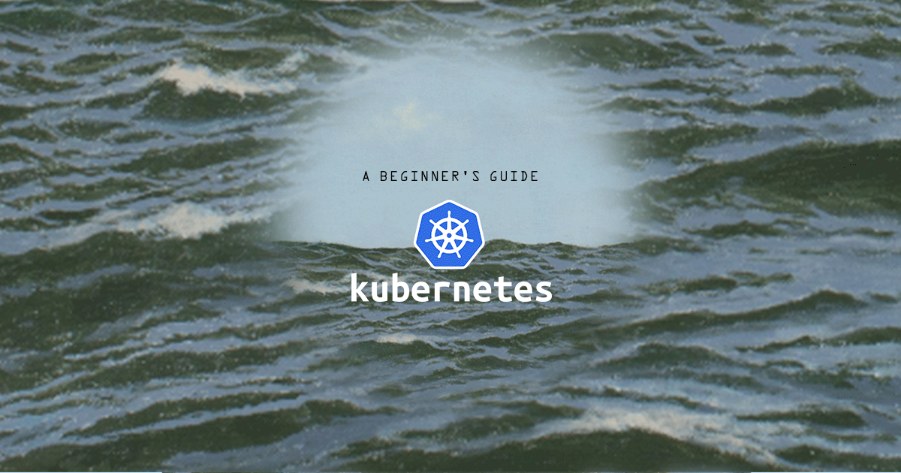

---
author:
  name: Andy Stevens
  email: docs@linode.com
description: 'An introduction to Kubernetes concepts and components.'
keywords: ['kubernetes','k8s','beginner','architecture']
license: '[CC BY-ND 4.0](https://creativecommons.org/licenses/by-nd/4.0)'
published: 2019-07-29
modified_by:
  name: Linode
title: "A Beginner's Guide to Kubernetes, Part 1: Introduction"
contributor:
  name: Linode
concentrations: ["Kubernetes"]
external_resources:
- '[Kubernetes API Documentation](https://kubernetes.io/docs/reference/generated/kubernetes-api/v1.13/)'
- '[Kubernetes Concepts Documentation](https://kubernetes.io/docs/concepts/)'
aliases: ['applications/containers/kubernetes/beginners-guide-to-kubernetes-introduction/','applications/containers/kubernetes/beginners-guide-to-kubernetes-part-1-introduction/']
---


This is the first guide in the [Beginner's Guide to Kubernetes](/docs/kubernetes/beginners-guide-to-kubernetes) series that explains the major parts and concepts of Kubernetes.


*Kubernetes*, often referred to as *k8s*, is an open source container orchestration system that helps deploy and manage containerized applications. Developed by Google starting in 2014 and written in the [Go](http://golang.org) language, Kubernetes is quickly becoming the standard way to architect horizontally-scalable applications.

In this guide you will learn about [containers and orchestration](#containers), [the Kubernetes API](#kubernetes-api), and [kubectl](#kubectl).

## Containers

Kubernetes is a container orchestration tool and, therefore, needs a container runtime installed to work.

In practice, the default container runtime for Kubernetes is [Docker](https://www.docker.com/), though other runtimes like [rkt](https://coreos.com/rkt/), and [LXD](https://linuxcontainers.org/lxd/introduction/) will also work. With the advent of the [Container Runtime Interface (CRI)](https://github.com/kubernetes/community/blob/master/contributors/devel/sig-node/container-runtime-interface.md), which hopes to standardize the way Kubernetes interacts with containers, other options like [containerd](https://containerd.io/), [cri-o](https://cri-o.io/), and [Frakti](https://github.com/kubernetes/frakti) have also become available. The guides in this series assume you have a working knowledge of containers and the examples will all use Docker as the container runtime.

 - **Containers** are similar to virtual machines. They are light-weight isolated runtimes that share resources of the operating system without having to run a full operating system themselves. Containers consume few resources but contain a complete set of information needed to execute their contained application images such as files, environment variables, and libraries.

 - **Containerization** is a virtualization method to run distributed applications in containers using microservices. Containerizing an application requires a base image that can be used to create an instance of a container. Once an application’s image exists, you can push it to a centralized container registry that Kubernetes can use to deploy container instances in a cluster’s *pods*, which you will learn more about in [Beginner's Guide to Kubernetes: Objects](/docs/kubernetes/beginners-guide-to-kubernetes-objects/#pods).

 - **Orchestration** is the automated configuration, coordination, and management of computer systems, software, middleware, and services. It takes advantage of automated tasks to execute processes. For Kubernetes, container orchestration automates all the provisioning, deployment, and availability of containers; load balancing; resource allocation between containers; and health monitoring of the cluster.

## Kubernetes API

Kubernetes is built around a robust RESTful API. Every action taken in Kubernetes, be it inter-component communication or user command, interacts in some fashion with the Kubernetes API. The goal of the API is to help facilitate the desired state of the Kubernetes cluster.

The Kubernetes API is a "declarative model", meaning that it focuses on the what, not the how. You tell it what you want to accomplish and it does it. This might involve creating or destroying resources but you don't have to worry about those details. To create this desired state, you create *objects*, which are normally represented by YAML files called *manifests*, and apply them through the command line with the **kubectl** tool.

## kubectl

kubectl is a command line tool used to interact with the Kubernetes cluster. It offers a host of features, including the ability to create, stop, and delete resources; describe active resources; and auto scale resources.

For more information on the types of commands and resources you can use with kubectl, consult the [Kubernetes kubectl documentation](https://kubernetes.io/docs/reference/kubectl/overview/).

## Next Steps

To continue in the [Beginner's Guide to Kubernetes](/docs/kubernetes/beginners-guide-to-kubernetes) series, visit part 2:

 - [Beginner's Guide to Kubernetes, Part 1: Introduction](/docs/kubernetes/beginners-guide-to-kubernetes-part-1-introduction/) (You Are Here)

 - [Beginner's Guide to Kubernetes, Part 2: Master, Nodes, and the Control Plane](/docs/kubernetes/beginners-guide-to-kubernetes-part-2-master-nodes-control-plane/)

 - [Beginner's Guide to Kubernetes, Part 3: Objects](/docs/kubernetes/beginners-guide-to-kubernetes-part-3-objects/)

 - [Beginner's Guide to Kubernetes, Part 4: Controllers](/docs/kubernetes/beginners-guide-to-kubernetes-part-4-controllers/)

 - [Beginner's Guide to Kubernetes, Part 5: Conclusion](/docs/kubernetes/beginners-guide-to-kubernetes-part-5-conclusion/)
