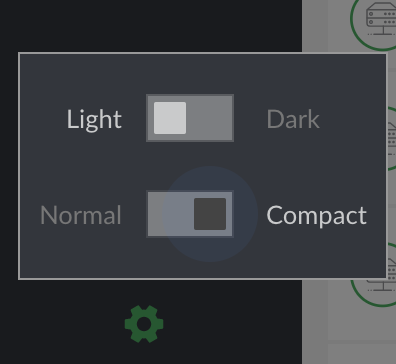

---
author:
  name: Linode
  email: docs@linode.com
description: 'Reference this guide when migrating from Linode''s Classic to Cloud Manager. This guide will help ease that transition by pointing out some of the features that you may need help finding and highlighting some settings that might make your overall manager experience better.'
og_description: 'Reference this guide when migrating from Linode''s Classic to Cloud Manager. This guide will help ease that transition by pointing out some of the features that you may need help finding and highlighting some settings that might make your overall manager experience better.'
keywords: ["classic manager","cloud manager","linode"]
license: '[CC BY-ND 4.0](https://creativecommons.org/licenses/by-nd/4.0)'
published: 2019-12-20
modified_by:
  name: Linode
title: 'Moving from Linode''s Classic Manager to Cloud Manager Reference Guide"'
h1_title: 'An Overview of Linode''s Cloud Manager for Classic Manager Users'
contributor:
  name: Linode
---
Linode's Classic Manager is being [retired on January 31, 2020](https://www.linode.com/2019/11/18/notice-legacy-linode-manager-users/). At that time, all users will be migrated to the new [Cloud Manager](https://cloud.linode.com/) when logging in to manage your infrastructure on Linode.

There have been substantial updates to Cloud Manager since it was introduced back in 2014. Cloud Manager has many new features, including an updated look-and-feel, modern user-interface, mobile support, and easy access to our recently released products. It’s also implemented solely atop our [public APIv4](https://developers.linode.com/api/v4).

[Development work for Cloud Manager](https://github.com/linode/manager/) will continue beyond January 31, 2020. As always, your feedback for Cloud Manager or any other aspect of our platform is welcome at feedback@linode.com.


We will continue to support APIv3 and the APIv3-based CLI beyond January 31, 2020.


## In this Guide

If you are a Classic Manager user, this guide will provide an overview of the features and services available in Linode's Cloud Manager. Some of the topics that will be discussed are:

- An introduction to each section of the Cloud Manager, including links to related guides throughout our documentation library.
- Specific features that you may need help finding due to differences in location between Classic Manager and Cloud Manager
- Settings that might make your overall Cloud Manager experience better

## Linodes

The Linodes section of Cloud Manager allows you to create and manage your Linodes. Each Linode instance in Cloud Manager includes:

- [Summary information](/docs/uptime/monitoring-and-maintaining-your-server/#linode-cloud-manager) about your Linode, like CPU usage, IPv4 and IPv6 traffic, and Disk IO
- Access to any of your Linode's attached Volumes and the ability to [create a Volume](/docs/platform/block-storage/how-to-use-block-storage-with-your-linode/#add-a-volume-from-the-linode-detail-page)
- Networking information and features, including the ability to add IPv4 and IPv6 addresses, [IP transfer](/docs/platform/manager/remote-access/#transferring-ip-addresses) and [IP sharing](/docs/platform/manager/remote-access/#configuring-ip-sharing)
- The ability to [resize your Linode](/docs/platform/disk-images/resizing-a-linode/), boot your Linode into [Rescue Mode](/docs/troubleshooting/rescue-and-rebuild/#rescue-mode-overview), and [rebuild your Linode](/docs/troubleshooting/rescue-and-rebuild/#rebuilding)
- Access to Linode's [Backup service](/docs/platform/disk-images/linode-backup-service/#enable-the-backup-service)
- An [Activity Feed](/docs/linode/cloud-manager/what-are-the-cloud-manager-events-and-activity-feeds), that displays any relevant events related to this Linode
- Settings that allow you to update your Linode's label, [reset your Linode's root password](/docs/quick-answers/linode-platform/reset-the-root-password-on-your-linode/), [manage system usage email notifications](docs/uptime/monitoring-and-maintaining-your-server/#configure-linode-cloud-manager-email-alerts), [manage Watchdog](docs/uptime/monitoring-and-maintaining-your-server/#configure-shutdown-watchdog) (Linode's automatic reboot feature), and delete your Linode
- Advanced configurations to [create disks and configuration profiles](/docs/platform/disk-images/disk-images-and-configuration-profiles/)
- [Cross data center migrations](/docs/platform/migrating-to-a-different-data-center/)

### Find Your Disks
In Classic Manager, Disks were located in the Linode Dashboard tab. In the Cloud Manager, Disks are now in the Advanced tab of the Linode.

1.  Click **Linodes** in the sidebar menu and select the one you wish to see your disks for.

1.  Then click the **Advanced** tab. The disks are located in the **Disks** panel. Here you can add a disk, or for each individual disk, you can click the **more options ellipses** to get a drop down menu which will allow you do choose options such as `Rename`, `Resize`, `Imagize`, `Clone`, and `Delete`.

    

### Reboot Your Linode

Rebooting your Linode is one of the most basic tasks you may want to perform. But it's location has changed from where it was found in Classic Manager.

You can reboot a Linode in two places. First, in the list of Linodes, click the **More Options Ellipses** and select *Reboot*.

If you have more than one *[Configuration Profile](/docs/platform/disk-images/disk-images-and-configuration-profiles/#configuration-profiles)*, a panel will appear to allow you to select which Configuration to boot. Select a Config and click the **Submit** button. Otherwise, a confirmation dialog will appear.

You can also reboot your Linode from within any Linode detail screen by clicking on the **Status Icon**. A drop down menu will appear, select *Reboot*.

Again, if you have more than one *Configuration Profile*, a panel will appear to allow you to select which Configuration to boot. Select a Config and click the **Submit** button. Otherwise, a confirmation dialog will appear.

### Delete a Public IP Address
You can delete Public IP addresses in both Classic and Cloud managers. In Classic Manager, this was done under the **Remote Access** tab in the Linode you wished to modify. In Cloud Manager it is done in the **Networking** tab.

1.  Click **Linodes** from the sidebar menu.

1.  Choose the Linode you wish to modify to enter the Linode detail screen. Then click on the **Networking** tab. Your IPv4 and IPv6 addresses will be listed here.

1.  Next to the public IPv4 address you wish to delete, click **more options ellipses**. Select the option to **Delete IP** from the drop down menu.

    

1.  A confirmation popup will appear asking if you are sure. Confirm.

    
You must have at least one public IP on a Linode. If you attempt to delete the last public IP on a Linode you will receive an error message *after* you confirm the deletion.


## Volumes

The **Volumes** section of Cloud Manager gives you access to Linode's [Block Storage](https://www.linode.com/products/block-storage/) service. To learn how to create, and manage Block Storage volumes using Cloud Manager, see our [How to Use Block Storage with Your Linode](/docs/platform/block-storage/how-to-use-block-storage-with-your-linode/) guide.

### Find Volumes
In Classic Manager, Volumes were found within a Linode's Dashboard. In Cloud Manager, Volumes are their own top-level menu item in the sidebar.


In Cloud Manager, you can also access Volumes from a [Linode's detail page](/docs/platform/block-storage/how-to-use-block-storage-with-your-linode/#add-a-volume-from-the-linode-detail-page).


## Object Storage

The **Object Storage** section of Cloud Manager gives you access to Linode’s [Object Storage service](https://www.linode.com/products/object-storage/) which is a globally-available, S3-compatible method for storing and accessing data. The Object Storage service is not available in Classic Manager.

To learn how to begin using Object Storage, view our [How to Use Linode Object Storage](/docs/platform/object-storage/how-to-use-object-storage/). To access all our Object Storage guides, see the [Object Storage section](/docs/platform/object-storage/) of our documentation site.

## NodeBalancers

Linode's [NodeBalancers service](https://www.linode.com/products/nodebalancers/) provides load balancing for your applications and services ensuring that they are highly available for users. To learn how to get started with NodeBalancers using Cloud Manager, see our [Getting Started with NodeBalancers](/docs/platform/nodebalancer/getting-started-with-nodebalancers/#additional-nodebalancers-and-features) guide.

## Domains (DNS Manager)
In Classic Manager, the DNS Manager is where you can control your domains. In Cloud Manager, the DNS Manager is located in the **Domains** link in the sidebar.

For more information on Cloud Manager's DNS Manager, see the following guides:

- [DNS Manager](/docs/platform/manager/dns-manager/).
- [Common DNS Configurations](/docs/networking/dns/common-dns-configurations/)
- [Configure Your Linode for Reverse DNS](/docs/networking/dns/configure-your-linode-for-reverse-dns/)

### Zone Files

While Cloud Manager does not include the "Check Zone" and "Zone File" features, it ensures that your Domain's zone file is created correctly:

- When creating a Zone File for a Domain, the Linode API v4 checks for any errors that may exist. If an error is found, the Cloud Manager will respond with the corresponding error. This means that the Cloud Manager will never allow you to create an invalid zone file.

- Once your Domain and corresponding Zone File are created, you can use the `dig` command to further verify that each domain record represents the information you expect, for example:

        dig example.com
        dig example.com MX

    See the [Use dig to Perform Manual DNS Queries](/docs/networking/dns/use-dig-to-perform-manual-dns-queries/) guide for more details on the `dig` command.

## Longview

The **Longview** section of Cloud Manager gives you access to Linode’s system data graphing service. It tracks metrics for CPU, memory, and network bandwidth, both aggregate and per-process, and it provides real-time graphs that can help expose performance problems. The Longview service offers both [free and paid plan tiers](/docs/platform/longview/what-is-longview/#longview-plan-details).

Longview is still being actively developed to reach parity with Classic Manager. To get started using Longview in Cloud Manager, see the [Understanding Linode Longview](/docs/platform/longview/what-is-longview/) guide.

## One-Click Apps

The **One-Click Apps** section of Cloud Manager gives you access to apps that make it easy to deploy and configure software on a Linode. Some popular One-Click Apps are [WordPress](/docs/platform/one-click/deploying-wordpress-with-one-click-apps/), [Minecraft](/docs/platform/one-click/deploying-minecraft-with-one-click-apps/), and [GitLab](/docs/platform/one-click/deploy-gitlab-with-one-click-apps/). We are actively adding new and useful One-Click apps. When a One-Click App is deployed, a new Linode is created and the appropriate software is installed with the configurations you provide. One-Click Apps are not available in Classic Manager.

See [How to Use Linode's One-Click Apps](/docs/platform/one-click/how-to-use-one-click-apps-at-linode/) to get started using One-Click Apps in Cloud Manager.

## Kubernetes

The Kubernetes section of Cloud Manager gives you access to our managed Kubernetes service, the Linode Kubernetes Engine (LKE). LKE is a fully-managed container orchestration engine for deploying and managing containerized applications and workloads. LKE combines Linode’s ease of use and [simple pricing](https://www.linode.com/pricing/) with the infrastructure efficiency of Kubernetes. LKE is not available in Classic Manager.

To get started using LKE, see our [A Tutorial for Deploying and Managing a Cluster with Linode Kubernetes Engine](/docs/kubernetes/deploy-and-manage-a-cluster-with-linode-kubernetes-engine-a-tutorial/).

## StackScripts

[StackScripts](https://linode.com/stackscripts/) provide Linode users with the ability to automate the deployment of custom systems on top of our default Linux distribution images. Linodes deployed with a StackScript run the script as part of the first boot process.

To get started using StackScripts in Cloud Manager, see the [Automate Deployment with StackScripts](/docs/platform/stackscripts/) guide.

### Find StackScripts

In Classic Manager, StackScripts were found in the Linodes tab. In Cloud Manager, StackScripts are their own top-level menu item in the sidebar.

## Images

The Images section of Cloud Manager give you access to Linode Images which allow you to take snapshots of your disks, and then deploy them to any Linode under your account. This can be useful for bootstrapping a master image for a large deployment, or retaining a disk for a configuration that you may not need running, but wish to return to in the future.

To get started using Images with Cloud Manager, see [Linode Images](/docs/platform/disk-images/linode-images/).

### Find Images
In Classic Manager, Manage Images was found in the Linodes tab. In Cloud Manager, Images are their own top-level menu item in the sidebar.

## Account (Management and Billing)

The **Account** section of Cloud Manager allows you to manage your account's billing information and users, and to configure various account-wide settings.

You can manage the following account and billing settings in the Account section of Cloud Manager:

- [Update contact information](/docs/platform/manager/accounts-and-passwords/#updating-contact-information) and [credit card information](/docs/platform/billing-and-support/manage-billing-in-cloud-manager/#updating-credit-card-information)
- [Make a payment with a credit card or Paypal](/docs/platform/billing-and-support/manage-billing-in-cloud-manager/#making-a-payment)
- View account promotion credits
- [View recent invoices and payments](/docs/platform/billing-and-support/manage-billing-in-cloud-manager/#accessing-billing-history)
- [Add new users and manage exiting user's profiles and permissions](/docs/platform/manager/accounts-and-passwords/#users-and-permissions)
- [Enable Backup auto enrollment for all new Linodes on your account](/docs/platform/disk-images/linode-backup-service/#auto-enroll-new-linodes-in-the-backup-service)
- [Enable Network Helper](/docs/platform/network-helper/#global)
- [Cancel Object Storage](/docs/platform/object-storage/how-to-use-object-storage/#cancel-object-storage)
- [Add the Linode Managed service to your account](/docs/platform/linode-managed/#getting-started)

### Find Credit Remaining
You can see the amount you have in available credit through the Cloud Manager by clicking on **Account** from the main menu. On the right hand side of the screen you’ll see a section marked **Billing Information**. If you have credit stored on your account, it’ll appear in green under the **Current Balance** field.

### Printing an Invoice
You can download and print an invoice in both Classic and Cloud Managers.

In Classic Manager this is found at the bottom of an invoice. You must open an invoice to see this link.

In Cloud Manager you can download a printable PDF of your invoice from the list of invoices or from within an individual invoice.

1.  Navigate to your Account by clicking on Account in the sidebar.

1.  Click on the Recent Invoices menu item in the Billing Panel. This will expand to show you a list of your recent invoices. Each invoice has a **Download PDF** link next to it.

    

1.  You can also click on any invoice to view it in the browser. At the top of the invoice there is a **Download PDF** button.

    

### Import Display Groups
If you have used the Display Groups feature in the Classic Manager, you can import your Display Groups to the Cloud Manager as tags:

1.  Navigate to the **Account** page in the sidebar links menu, then click on the **Settings** tab.

1.  Expand the panel labeled **Import Display Groups as Tags** and then click **Import Display Groups**:

    

1.  A form will appear that lists your Display Groups and asks you to confirm the import action. To proceed, click the **Import Display Groups Now** button in this form.

    
Importing your Display Groups is a **one-time** operation. If you don't have any Display Groups configured in the Classic Manager this feature will not appear in the Cloud Manager.


## My Profile

The **My Profile** section of Cloud Manager provides access to various settings related to your Linode account's profile. This area of Cloud Manager contains access to the following features and settings:

- [Changing your account's associated email address](/docs/platform/manager/accounts-and-passwords/#changing-your-email-address) and timezone
- [Resetting your Account password](/docs/platform/manager/accounts-and-passwords/#changing-or-resetting-your-linode-cloud-manager-password) managing trusted devices
- [Enabling two-factor authentication](/docs/security/linode-manager-security-controls/#enable-two-factor-authentication)
- Managing trusted devices
- [Adding and managing public SSH keys](/docs/security/authentication/use-public-key-authentication-with-ssh/#upload-your-ssh-key-to-the-cloud-manager)
- [Managing LISH authentication methods](/docs/platform/manager/using-the-linode-shell-lish/#add-your-public-key)
- [Add and manage personal and third party API v4 access tokens](/docs/platform/api/getting-started-with-the-linode-api/#get-an-access-token)
- [Creating and managing OAuth Apps](/docs/platform/api/how-to-create-an-oauth-app-with-the-linode-python-api-library/#obtaining-a-client-id-and-a-client-secret)
- [Access Linode referral codes](/docs/platform/billing-and-support/how-linode-billing-works/#referral-credits)
- Enable email alerts for account activity

### API Keys/Personal Access Tokens
API Keys from Classic Manager do not transfer. Therefore, if you have keys generated in Classic, you will not see them in Cloud Manager. Additionally, keys are called Personal Access Tokens and can be used for a variety of different uses.

1.  To generate a new Personal Access Token, navigate to your profile by clicking on your username and select **My Profile** from the drop down menu. Then click on the **API Tokens** tab.

    

1.  Click **Add a Personal Access Token**. A panel will display allowing you to give this token a label and choose the access rights you want users authenticated with the new token to have.

    

1.  When you have finished, click **Submit** to generate a new Personal Access Token. Copy the token and save it to a secure location before closing the popup. **You will not be able to view this token through the Cloud Manager after closing the popup.**

### Manage Email Event Notifications

You can manage your email event notifications in both Classic and Cloud manager. These notifications will alert you when new events such as booting, shutting down, or updates to a Linode occur on your account.

In Classic Manager this was done in **Notifications** under **my profile**. In Cloud Manager this is done in **Settings** under **Profile**.

## User Interface Enhancements

### Compact Mode and Dark Mode
Cloud Manager by default uses more whitespace on the screen. However, there is a *Compact Mode* which compresses this extra space and allows more information to be displayed on the screen. This setting is located at the bottom left hand corner of the screen in the gear icon. This is also where you can toggle on *Dark Mode*.

### Accessibility

The Linode Cloud Manager has been built with accessibility in mind. Currently, the Cloud Manager is actively being developed to achieve [WCAG 2.0 Level AA](https://www.w3.org/TR/WCAG20/).

We have received a lot of helpful feedback from our users regarding accessibility. While we have addressed a lot of your feedback, this is still a work in progress and will be iterated upon with time. Please contact feedback@linode.com with any comments or requests regarding accessibility.

## Next Steps

See the following guides for more features of Cloud Manager:

 - [What are the Cloud Manager Events and Activity Feeds](/linode/cloud-manager/what-are-the-cloud-manager-events-and-activity-feeds/)
 - [Longview in Cloud Manager](/platform/longview/what-is-longview/)

 If you still need help finding features in or using Cloud Manager, please contact [Linode Support](/platform/billing-and-support/support/).