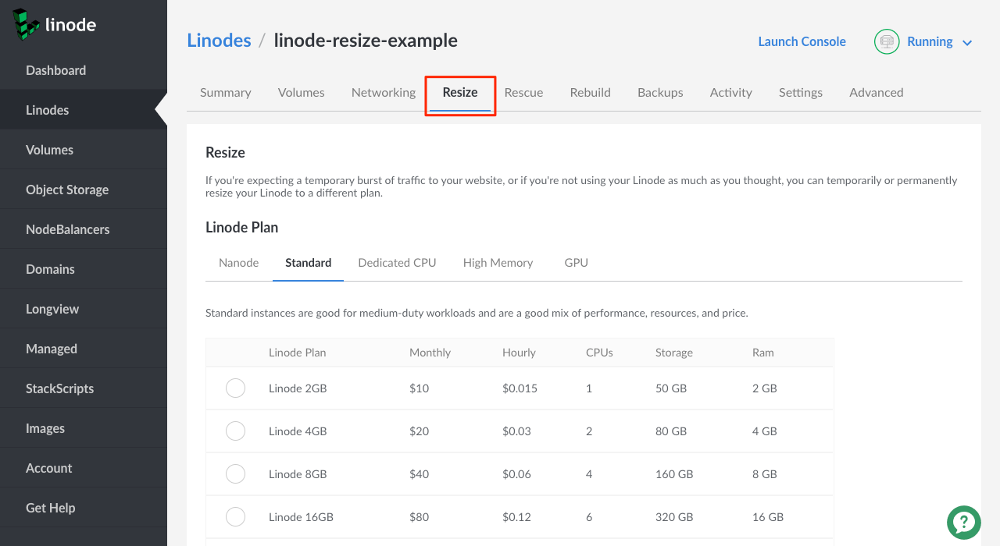
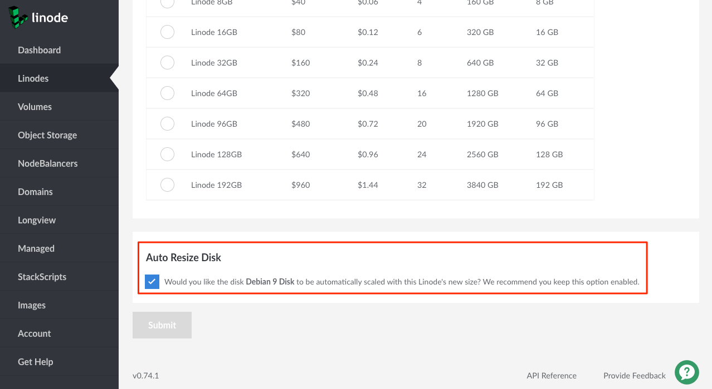

---
author:
  name: Linode
  email: docs@linode.com
description: Our guide to upgrading and resizing your Linode
keywords: ["upgrading", "resizing", "disk space"]
license: '[CC BY-ND 4.0](https://creativecommons.org/licenses/by-nd/4.0)'
aliases: ['migrate-to-linode/disk-images/resizing-a-linode/','resizing/']
modified: 2019-03-28
modified_by:
  name: Linode
published: 2017-02-14
title: Resizing a Linode
classic_manager_link: platform/disk-images/resizing-a-linode-classic-manager/
---

We make it easy to upgrade or downgrade your Linode by changing plans and adding additional resources. If you're expecting a temporary burst of traffic to your website, or if you're not using your Linode as much as you thought, you can temporarily or permanently resize your Linode to a different plan.


Linodes can be resized to a smaller or larger plan. A [standard](https://www.linode.com/products/standard-linodes) plan can also be converted to a [high memory](https://www.linode.com/pricing/high-memory) plan, or vice versa.


## Resizing Your Linode

You can move your Linode from one plan to another by using the *resize* feature. To complete the resizing process, **your Linode will be powered off** and migrated to a different host in the same data center. Your data, configuration profiles, and IP addresses will all be moved to the new host. Please note that the migration will take approximately 1 minute for every 3-5 gigabytes of data.


If you're downgrading your plan, verify that your disks are using less space than the new plan provides. For more information, see our documentation on [resizing a disk](/docs/platform/disk-images/disk-images-and-configuration-profiles/#resizing-a-disk).


Here's how to resize your Linode:

1.  Log in to the [Linode Manager](https://cloud.linode.com).
1.  Click the **Linodes** link in the sidebar.
1.  Select a Linode from the list.
1.  Click the **Resize** tab. The webpage shown below appears.

    

1.  You can automatically resize your primary disk by selecting the **Auto Resize Disk** checkbox. This option is not available if you are resizing to a smaller plan and have a disk greater in size than the target plan allows. In that case, you must delete resize your disk before selecting a new plan. Additionally, your disks must be of type `ext 4`,`ext 3`, or `swap`.

    

1.  Select a plan and click the **Submit** button. Your Linode will be powered off and moved to another host. Depending on the size of your Linode, this process can take up to one hour.

1.  (Optional) When the migration completes, check your disk storage allocation meter. If you resized your Linode to a larger plan and the main disk was not automatically resized, you'll have additional un-used storage to allocate to your disks. You may want to add some of this storage to one of your disks if the internal filesystem on it is running low on free space, or just so you can use it in the future.

    Navigate to your Linode's **Advanced** tab to view your disk storage allocation meter. Click on the **more options** link (...) next to the disk you'd like to allocate the extra storage to and select **Resize**.

    

    The *Resize Disk* panel will appear. In the **Size** field, enter a new size in the specified range and click **Resize**.

    

1.  Once completed, your Linode will still be powered off. Scroll to the top of the page and click on the **Offline** button and select **Power On**.

Your Linode has been successfully resized and migrated to the new host.
