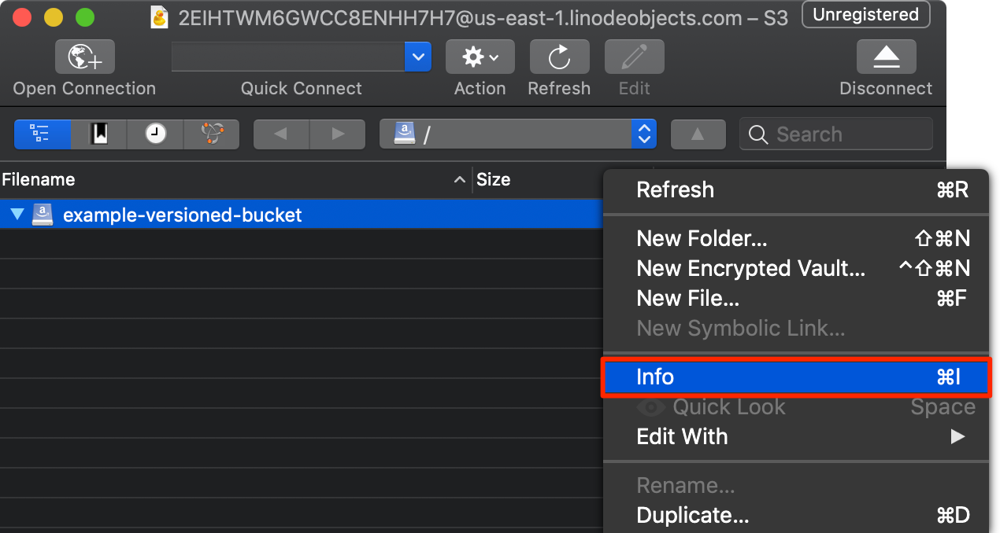
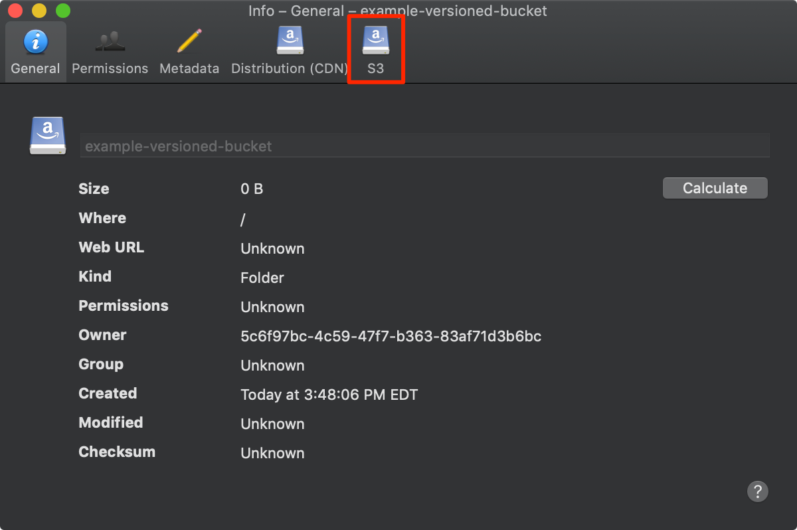
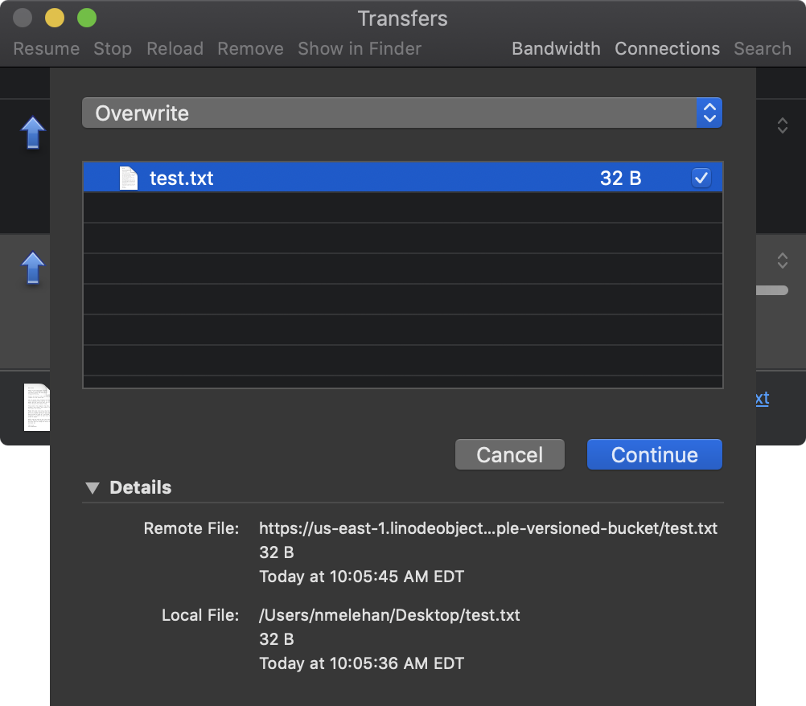
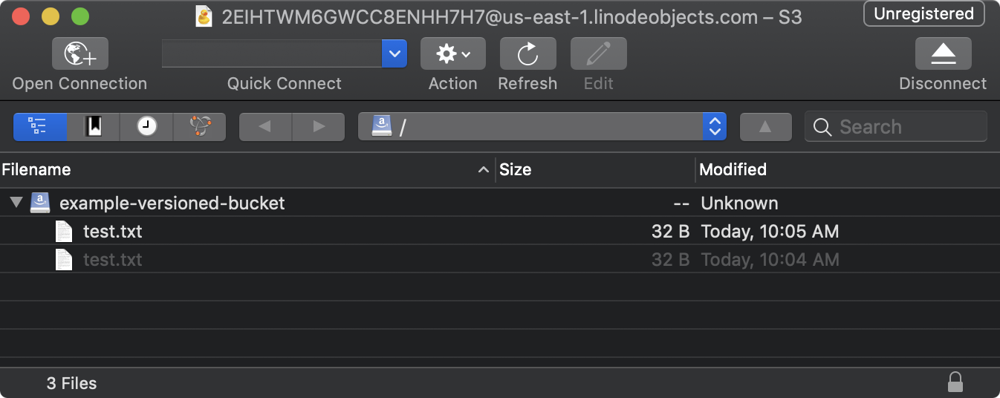

---
author:
  name: Linode Community
  email: docs@linode.com
description: 'How to use bucket versioning with Linode Object Storage to track and saves changes to your objects.'
keywords: ['object','storage','bucket','version','versioning']
license: '[CC BY-ND 4.0](https://creativecommons.org/licenses/by-nd/4.0)'
published: 2019-10-14
modified_by:
  name: Linode
title: "Bucket Versioning with Linode Object Storage"
contributor:
  name: Linode
external_resources:
  - '[AWS CLI S3 API command reference](https://docs.aws.amazon.com/cli/latest/reference/s3api/index.html)'
---


[Linode Object Storage](/docs/platform/object-storage/) is now available to the general public in the Newark data center! Starting November 1, 2019, all customers with objects stored in Object Storage buckets will be billed. For more information, see our [Object Storage Pricing and Limitations](https://www.linode.com/docs/platform/object-storage/pricing-and-limitations/) guide.


Linode Object Storage allows for bucket versioning so that you can retain different versions of your objects within buckets. This makes it easy to save older versions of objects, as well as quickly revert to an object's previous state.

In this guide, you will learn about:

- [Bucket versioning](/docs/platform/object-storage/bucket-versioning/#bucket-versioning) concepts.
- How to use the [graphical user interface (GUI) Cyberduck](/docs/platform/object-storage/bucket-versioning/#cyberduck) client to version buckets.
- How to version buckets from the [AWS command line interface (CLI)](/docs/platform/object-storage/bucket-versioning/#aws-cli), which is compatible with Linode Object Storage.

## Before You Begin

You should familiarize yourself with the basics of Linode Object Storage by reading the [How to Use Linode Object Storage](/docs/platform/object-storage/how-to-use-object-storage/) guide.

You'll also need to have a bucket with which you want to enable bucket versioning. Follow the [Create a Bucket](/docs/platform/object-storage/how-to-use-object-storage/#create-a-bucket) section of the How to Use Linode Object Storage guide if you do not already have one.

## Bucket Versioning

Bucket versioning works by saving separate versions of objects in a bucket. When bucket versioning is enabled, an object that is uploaded to a bucket won't overwrite a previous copy of that object. Instead, each version of the object is given a different ID number and saved.

When attempting to view the object over HTTP or to download the object without supplying a version ID, the latest version of the object is returned. If you delete an object with bucket versioning enabled, a delete marker is inserted into the bucket to report that the object has been deleted, but the bucket will retain all previous versions of the object. Any further retrieval operations will return the most recent version of an object.


Every version of an object counts towards the monthly billable storage quota. While saving a few revisions is probably not something to worry about, large version controlled buckets with many thousands of objects will see a noticeable increase in storage space demands, and should be monitored carefully.


### Cyberduck

Cyberduck is a GUI application that supports a wide variety of file transfer protocols, including S3-compatible Object Storage. For basic Cyberduck functionality, such as creating buckets and uploading objects, consult our [How to Use Linode Object Storage](/docs/platform/object-storage/how-to-use-object-storage/#cyberduck) guide.


If you don't have Cyberduck set up on your computer, visit the [Install and Configure Cyberduck](/docs/platform/object-storage/how-to-use-object-storage/#install-and-configure-cyberduck) of the How to Use Linode Object Storage guide.


To use bucket versioning with Cyberduck:

1.  Enable bucket versioning for your bucket. Right-click or control-click on the bucket and select **Info** from the bucket's context menu, or select **File > Info** from the menu bar.

    

1.  A settings menu will appear. Select the **S3** menu heading.

    

1.  In the **Versioning** section, check the checkbox labeled **Bucket Versioning**.

    

1.  Your bucket will now retain previous versions of the objects within it. To test this functionality, create an example text document on your computer and add some text to it:

    
This is version 1 of the object.


    Upload this file to your bucket by dragging it into Cyberduck, or by selecting **File > Upload** from the menu bar.

1.  Now, edit the same file on your computer and make a small change. We will use this change to demonstrate bucket versioning.

    
This is version 2 of the object.


    Save the change and upload the file to your bucket just as you did in the previous step. Cyberduck will prompt you this time to confirm that you'd like to upload the file. Though the dropdown menu says **Overwrite**, the file will not be overwritten.

    

1.  You now have two objects in your bucket, though initially you may only see one. To view the different saved versions of your object, select **View** from the menu bar and click on **Show Hidden Files**.

    You should now see two files in your bucket, with the hidden file that you've just revealed being grayed-out. This grayed-out file is the older version of the file that you uploaded first.

    
You may have to click the **Refresh** button in Cyberduck's toolbar to see the hidden files.


    

1.  Double click the grayed-out version of the file (the one with the earlier modified date) to download the file. Once opened, you'll see that the file contains the contents of the first revision.

1.  To revert to a previous file revision, right-click or control-click on an object and select **Revert**. This will create a new object in the bucket, preserving the state of the previous two objects. At this point the current object will contain the contents of revision one, the second object will contain the contents of revision two, and the third object will contain to the contents of revision one. You can see, then, how bucket versioning works to maintain a stateful history.

    
Each file has its own permissions. If you'd like to view objects via HTTP, then you'll need to manually set the permissions for each object to *Everyone* each time you upload or revert to a different version of the object, as described in the [How to Use Linode Object Storage](/docs/platform/object-storage/how-to-use-object-storage/#upload-download-and-delete-an-object-with-cyberduck) guide.


### AWS CLI

Because Linode Object Storage is compatible with S3, several tools that are designed to work with S3 can be adapted to Linode Object Storage, like the AWS CLI.


The AWS CLI can be installed using [pip](https://pip.pypa.io/en/stable/), the Python package manager, on macOS and Linux:

    pip install awscli

If you are using Windows, you can download the CLI by visiting the [AWS CLI homepage](https://aws.amazon.com/cli/).

You'll need to configure the AWS CLI before you can use it. To do so, run the configure command:

    aws configure

You'll be prompted to enter your AWS access key and AWS secret access key, but you can enter your Linode access key and Linode secret access key here instead. You can leave the other fields blank.


To use bucket versioning with the AWS CLI:

1.  Turn on bucket versioning with the `put-bucket-versioning` command. Supply the Linode Object Storage endpoint and bucket name to the command. In the below example, the bucket is named `bucket-versioning-example`:

        aws s3api put-bucket-versioning --endpoint=http://us-east-1.linodeobjects.com --bucket=bucket-versioning-example --versioning-configuration Status=Enabled

1.  The above command won't prompt any response. To check on the status of bucket-versioning, issue the `get-bucket-versioning` command, again supplying the Linode Object Storage endpoint and your bucket name:

        aws s3api get-bucket-versioning --endpoint=http://us-east-1.linodeobjects.com --bucket=bucket-versioning-example

    You should see output like the following:

    
{
    "Status": "Enabled",
    "MFADelete": "Disabled"
}


    Here you can see that bucket versioning has been successfully applied to the bucket because the `Status` is set to `Enabled`.

1.  To test bucket versioning, create an example text document on your computer and add some text to it:

    
This is version 1 of the file.


1.  Upload the file to your bucket using the `put-object` command, again supplying the Linode Object Storage endpoint and your bucket name:

        aws s3api put-object --endpoint=http://us-east-1.linodeobjects.com  --bucket=bucket-versioning-example --key test.txt --body test.txt

    In the above command, the `key` is the name you would like to give the object after it is uploaded, and the `body` is the local filename of the object. These can be different.

    
When retrieving the file you will need to give the object's `key` rather than it's local filename.


1.  You should see output like the following:

    
{
    "ETag": "\"9a7b64c98b066602b21f869ae7cd673a\"",
    "VersionId": "4ACJQUNQ1ORV2oZ1SRE7l2M7nTjD1pv"
}


    Take note of the `VersionId`, which will be referenced later.

1.  Now, modify the local file to indicate that this file is a different version than the one you previously uploaded:

    
This is version 2 of the file.


1.  Upload the modified version of the file to Object Storage:

        aws s3api put-object --endpoint=http://us-east-1.linodeobjects.com  --bucket=bucket-versioning-example --key test.txt --body test.txt

    You should see output like the following:

    
{
    "ETag": "\"38b0d2ff1c03df82aea67222983d337e\"",
    "VersionId": "cdw7Lz4CPdm3wAJwBIJ6NhOUDqZo-Y7"
}


    Note that the `VersionId` has changed to reflect the newer version of the object.

1.  You now have two versions of the object in your bucket. To view these objects, use the `list-object-versions` command:

        aws s3api list-object-versions --endpoint=http://us-east-1.linodeobjects.com --bucket=bucket-versioning-example

    You should see output like the following:

    
{
    "Versions": [
        {
            "ETag": "\"38b0d2ff1c03df82aea67222983d337e\"",
            "Size": 6,
            "StorageClass": "STANDARD",
            "Key": "test.txt",
            "VersionId": "cdw7Lz4CPdm3wAJwBIJ6NhOUDqZo-Y7",
            "IsLatest": true,
            "LastModified": "2019-09-18T11:51:33.070Z",
            "Owner": {
                "DisplayName": "a9354920-007a-4480-9271-06d3ff7f8426",
                "ID": "a9354920-007a-4480-9271-06d3ff7f8426"
            }
        },
        {
            "ETag": "\"9a7b64c98b066602b21f869ae7cd673a\"",
            "Size": 6,
            "StorageClass": "STANDARD",
            "Key": "test.txt",
            "VersionId": "4ACJQUNQ1ORV2oZ1SRE7l2M7nTjD1pv",
            "IsLatest": false,
            "LastModified": "2019-09-18T11:51:23.041Z",
            "Owner": {
                "DisplayName": "a9354920-007a-4480-9271-06d3ff7f8426",
                "ID": "a9354920-007a-4480-9271-06d3ff7f8426"
            }
        }
    ]
}


    Each version of the `test.txt` object is represented in the output.

1.  To download a previous version of an object, use the `get-object` command and supply the `version-id` of the earliest copy of the object:

        aws s3api get-object --endpoint=http://us-east-1.linodeobjects.com --bucket=bucket-versioning-example --key=test.txt --version-id=4ACJQUNQ1ORV2oZ1SRE7l2M7nTjD1pv test_old.txt

    Be sure to include an output filename for the downloaded object as the last parameter. In the above command the output file is named `test_old.txt`.

    You should see output like the following:

    
{
    "AcceptRanges": "bytes",
    "LastModified": "Wed, 18 Sep 2019 11:51:23 GMT",
    "ContentLength": 6,
    "ETag": "\"9a7b64c98b066602b21f869ae7cd673a\"",
    "VersionId": "4ACJQUNQ1ORV2oZ1SRE7l2M7nTjD1pv",
    "ContentType": "binary/octet-stream",
    "Metadata": {
        "version-id": "r71GBm28-B2ynT89nAdAEIpXXZwUtqr"
    }
}


    Open the downloaded file and confirm that the first version of the file was downloaded properly.

1.  To restore to a previous version of an object using the AWS CLI, you can download the version you want to restore to and then re-upload that file. Alternatively, if there is only one newer version of the object, you can delete the newer version of the object and Object Storage will automatically serve the next most recent version.
