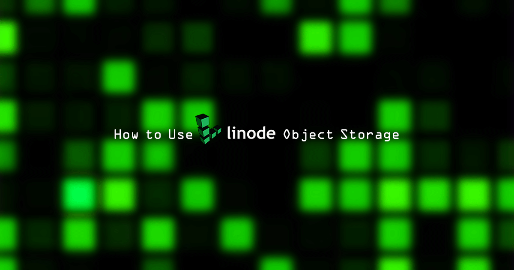
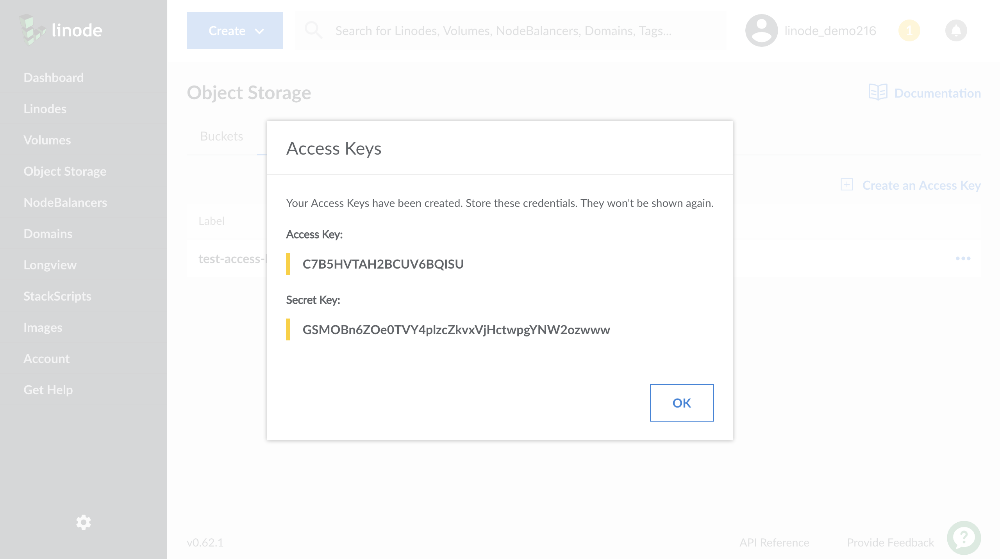
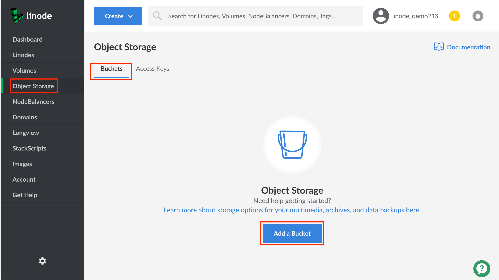
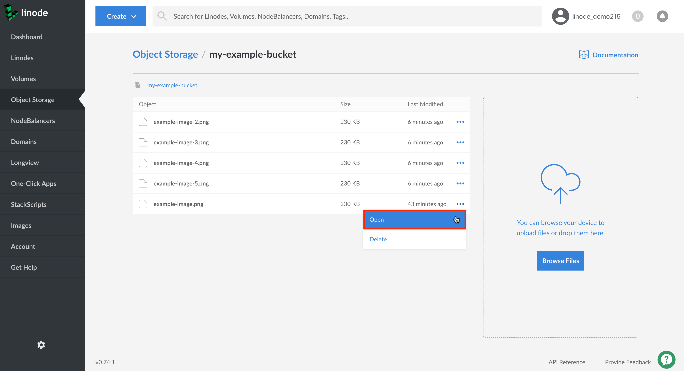
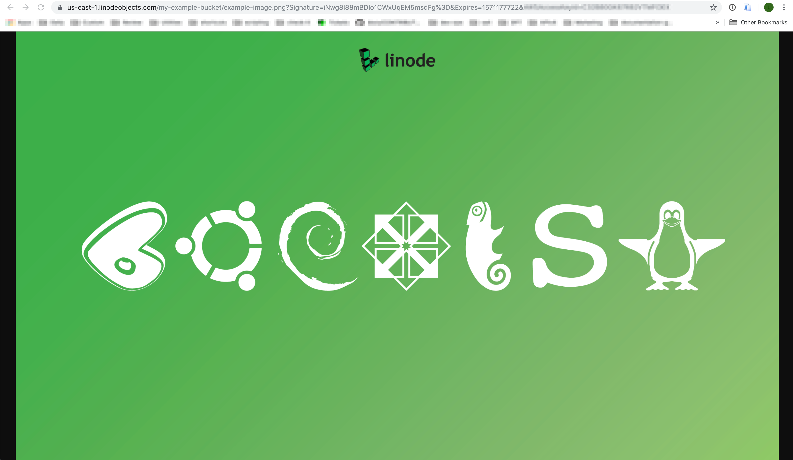
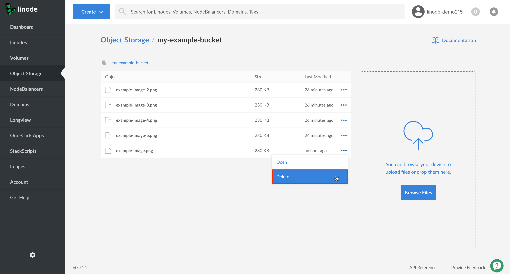
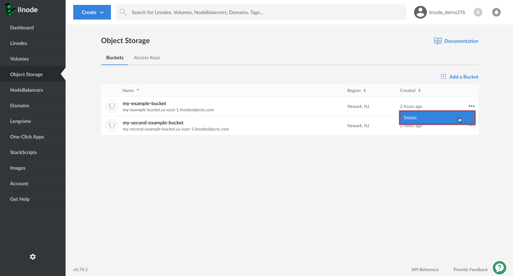
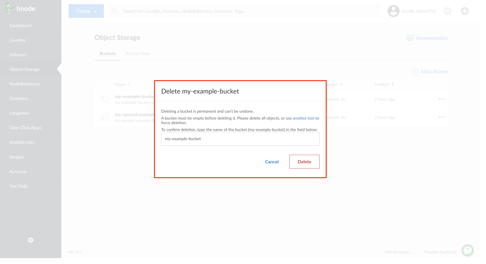
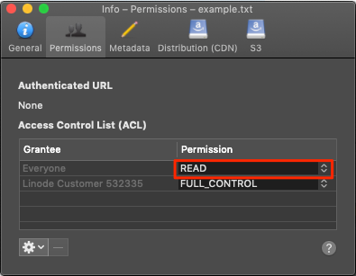

---
author:
  name: Linode Community
  email: docs@linode.com
description: "Get started using Linode's Object Storage."
keywords: ['object','storage','bucket']
license: '[CC BY-ND 4.0](https://creativecommons.org/licenses/by-nd/4.0)'
published: 2019-04-12
modified: 2019-04-12
modified_by:
  name: Linode
title: "How to Use Linode Object Storage"
contributor:
  name: Linode
external_resources:
- '[S3cmd usage and command reference](https://s3tools.org/usage)'
---


[Linode Object Storage](/docs/platform/object-storage/) is now available to the general public in the Newark data center! Starting November 1, 2019, all customers with objects stored in Object Storage buckets will be billed. For more information, see our [Object Storage Pricing and Limitations](/docs/platform/object-storage/pricing-and-limitations/) guide.


Linode's Object Storage is a globally-available, S3-compatible method for storing and accessing data. Object Storage differs from traditional hierarchical data storage (as in a Linode's disk) and [Block Storage Volumes](https://www.linode.com/docs/platform/block-storage/). Under Object Storage, files (also called *objects*) are stored in flat data structures (referred to as *buckets*) alongside their own rich metadata.

Additionally, **Object Storage does not require the use of a Linode.** Instead, Object Storage gives each object a unique URL with which you can access your data. An object can be publicly accessible, or you can set it to be private and only visible to you. This makes Object Storage great for sharing and storing unstructured data like images, documents, archives, streaming media assets, and file backups, and the amount of data you store can range from small collections of files up to massive libraries of information. Lastly, Linode Object Storage has the built-in ability to [host a static site](/docs/platform/object-storage/host-static-site-object-storage/).

In this guide you will learn:

 - How to get set-up for object storage by [creating an Object Storage Key Pair](/docs/platform/object-storage/how-to-use-object-storage/#object-storage-key-pair).

 - About the variety of first-party and third-party [tools available](/docs/platform/object-storage/how-to-use-object-storage/#object-storage-tools) to access and use the service.

 - How to connect to Object Storage, how to upload and access objects, and how to host a static site using:

   - [Cloud Manager](/docs/platform/object-storage/how-to-use-object-storage/#cloud-manager)

   - [Linode CLI](/docs/platform/object-storage/how-to-use-object-storage/#linode-cli)

   - [s3cmd](/docs/platform/object-storage/how-to-use-object-storage/#s3cmd)

   - [Cyberduck](/docs/platform/object-storage/how-to-use-object-storage/#cyberduck)

## Object Storage Key Pair

The first step towards using Object Storage is to create a pair of keys for the service. This pair is composed of an *access key* and a *secret key*:

-   The access key allows you to access any objects that you set to have private read permissions.

    
To use your access key when viewing a private object, you first need to generate a *signed* URL for the object. The signed URL is much like the standard URL for your object, but some extra URL parameters are appended to it, including the access key. Instructions for generating a signed URL can be found for each of the tools outlined in this guide.


-   Your secret key is used together with your access key to authenticate the various Object Storage tools with your Linode account. You should not share the secret key.

    
Each Object Storage key pair on your Linode account has complete access to all of the buckets on your account.


### Generate a Key Pair

1.  Log into the [Linode Cloud Manager](https://cloud.linode.com).

    
Object Storage is not available in the Linode Classic Manager.


1.  Click on the **Object Storage** link in the sidebar, click the **Access Keys** tab, and then click the **Create an Access Key** link.

    

2.  The **Create an Access Key** menu will appear.

    

3.  Enter a label for the key pair. This label will be how you reference your key pair in the Linode Cloud Manager. Then, click **Submit**.

4.  A window will appear that contains your access key and your secret key. Write these down somewhere secure. The access key will be visible in the Linode Cloud Manager, but **you will not be able to retrieve your secret key again once you close the window.**

    

    You now have the credentials needed to connect to Linode Object Storage.

## Object Storage Tools

There are a number of tools that are available to help manage Linode Object Storage. This guide explains how to install and use the following options:

-   The [Linode Cloud Manager](#cloud-manager) can be used to create buckets, and upload and delete objects, as well as create access keys for use with the S3 compatible clients.

-   The [Linode CLI](#linode-cli) has an Object Storage plugin and can be used to create and remove buckets, add and remove objects, and convert a bucket into a static site from the command line.

-   [s3cmd](#s3cmd) is a powerful command line utility that can be used with any S3-compatible object storage service, including Linode's. s3cmd can be used to create and remove buckets, add and remove objects, convert a bucket into a static site from the command line, plus other functions like syncing entire directories up to a bucket.

-   [Cyberduck](#cyberduck) is a graphical utility available for Windows and macOS and is a great option if you prefer a GUI tool.

## Cloud Manager

### Create a Bucket

The Cloud Manager provides a web interface for creating buckets. To create a bucket:

1.  If you have not already, log into the [Linode Cloud Manager](https://cloud.linode.com).

1.  Click on the **Object Storage** link in the sidebar, and then click on **Add a Bucket**.

    

1.  The **Create a Bucket** menu will appear.

    

1.  Add a label for your bucket.

    
Bucket labels need to be unique within the same cluster, including buckets on other users' Linode accounts. If the label you enter is already in use, you will have to choose a different label. Additionally, bucket labels have the following rules: 
&nbsp;&nbsp;&nbsp;&bull;&nbsp;&nbsp;Cannot be formatted as IP addresses 
&nbsp;&nbsp;&nbsp;&bull;&nbsp;&nbsp;Must be between 3 and 63 characters in length 
&nbsp;&nbsp;&nbsp;&bull;&nbsp;&nbsp;Can only contain lower-case characters, numbers, periods, and dashes 
&nbsp;&nbsp;&nbsp;&bull;&nbsp;&nbsp;Must start with a lowercase letter or number 
&nbsp;&nbsp;&nbsp;&bull;&nbsp;&nbsp;Cannot contain underscores (_), end with a dash (-) or period (.), have consecutive periods (.), or use dashes (-) adjacent to periods (.)


1.  Choose a cluster location for the bucket to reside in.

1.  Click **Submit**. You are now ready to [upload objects to your bucket](#upload-objects-to-a-bucket).

### Upload Objects to a Bucket

1.  If you have not already, log into the [Linode Cloud Manager](https://cloud.linode.com).

1.  Click on the **Object Storage** link in the sidebar. You will see a list of all your buckets. Click on the bucket you'd like to begin uploading objects to.

    

1. You will see your bucket's **Objects Listing Page**. In the example, the *my-example-bucket* does not yet contain any objects. You can use the **Upload Files Pane** to drag and drop a file from your computer to your object storage bucket.

    
You can drag and drop multiple files to the **Upload Files Pane** at one time.
    

    

    You can also click on the **Browse Files** button to bring up your computer's file browser and select a file to upload to your bucket.

    

1.  When the upload has completed, your object will be visible on the **Objects Listing Page**.

    

### View Bucket Objects

1.  If you have not already, log into the [Linode Cloud Manager](https://cloud.linode.com).

1.  Click on the **Object Storage** link in the sidebar. You will see a list of all your buckets. Click on the bucket whose objects you'd like to view.

    

1. You will see your bucket's **Objects Listing Page**, which displays all of your bucket's objects.

    

1. Click on the ellipsis menu corresponding to the object you'd like to view. Then, select **Open**.

    

1. A browser window will open your object's unique URL and display your object. In the example, the browser displays a `.png` image.

    

### Delete Objects from a Bucket

1.  If you have not already, log into the [Linode Cloud Manager](https://cloud.linode.com).

1.  Click on the **Object Storage** link in the sidebar. You will see a list of all your buckets. Click on the bucket whose objects you'd like to delete.

    

1. You will see your bucket's **Objects Listing Page**, which displays all of your bucket's objects.

    

1. Click on the ellipsis menu corresponding to the object you'd like to delete. Then, select **Delete**.

    

1. A dialog box will appear prompting you to confirm if you'd like to delete the object. Click **Delete** to proceed. Once the object has been deleted, it will no longer be visible on the **Objects Listing Page**.

### Delete a Bucket


You can only delete an empty Object Storage bucket. See the [Delete Objects from a Bucket](#delete-objects-from-a-bucket) section for information on deleting a bucket's objects using the Cloud Manager.


1.  If you have not already, log into the [Linode Cloud Manager](https://cloud.linode.com).

1.  Click on the **Object Storage** link in the sidebar. You will see a list of all your buckets.

1. Click on the ellipsis menu corresponding to the bucket you'd like to delete. Then, select **Delete**.

    

1. A dialog box will appear prompting you to enter the bucket's name as a way to confirm that you'd like to delete the bucket. Type your bucket's name into the text entry field and click **Delete**.

    

    Once the bucket has been deleted, it will no longer be visible on the **Buckets Listing Page**.

## Linode CLI

The Linode Command Line Interface (CLI) is a command line utility that allows you complete control over your Linode account. With the Object Storage plugin, you can also create and remove buckets, upload objects, and more.

### Install and Configure the CLI

1.  Download the Linode CLI, or, if you have already downloaded it, make sure it has been upgraded to the latest version:

        pip install linode-cli --upgrade

1.  Configure the Object Storage plugin:

        linode-cli obj --help

    You will be prompted to enter in your Personal Access Token and default settings for deploying new Linodes.

1.  Install the `boto` module:

        pip install boto

Now you are ready to create buckets and upload objects.

### Create a Bucket with the CLI

To create a bucket with the Linode CLI, issue the `mb` command.

    linode-cli obj mb my-example-bucket


Bucket labels need to be unique within the same cluster, including buckets on other users' Linode accounts. If the label you enter is already in use, you will have to choose a different label. Additionally, bucket labels have the following rules: 
&nbsp;&nbsp;&nbsp;&bull;&nbsp;&nbsp;Cannot be formatted as IP addresses 
&nbsp;&nbsp;&nbsp;&bull;&nbsp;&nbsp;Must be between 3 and 63 characters in length 
&nbsp;&nbsp;&nbsp;&bull;&nbsp;&nbsp;Can only contain lower-case characters, numbers, periods, and dashes 
&nbsp;&nbsp;&nbsp;&bull;&nbsp;&nbsp;Must start with a lowercase letter or number 
&nbsp;&nbsp;&nbsp;&bull;&nbsp;&nbsp;Cannot contain underscores (_), end with a dash (-) or period (.), have consecutive periods (.), or use dashes (-) adjacent to periods (.)


To delete a bucket, issue the `rb` command:

    linode-cli obj rb my-example-bucket

If your bucket has objects in it, you will not be able to immediately delete it from the Linode CLI. Instead, remove the objects first, then delete the bucket. The [s3cmd](/docs/platform/object-storage/how-to-use-object-storage/#s3cmd) tool has commands for deleting all objects from a bucket, and it can also force-delete a bucket with objects in it.

### Upload, Download, and Delete an Object with the CLI

1.  As an example object, create a text file and fill it with some example text.

        echo 'Hello World!' > example.txt

1.  To upload an object to a bucket using the Linode CLI, issue the `put` command. Supply the object name as the first parameter and the bucket label as the second:

        linode-cli obj put --acl-public example.txt my-example-bucket

    The file will now be accessible at the URL `http://my-example-bucket.us-east-1.linodeobjects.com/example.txt`.

    
The `--acl-public` flag is used to make the object publicly accessible, meaning that you will be able to access the object from its URL. By default, all objects are set to private. To make a public file private, or a private file public, use the `setacl` command and supply the corresponding flag.

For instance, if you want to make a public file private, you would supply the `--acl-private` flag:

    linode-cli obj setacl --acl-private my-example-bucket example.txt


1.  To download an object, issue the `get` command. Supply the label of the bucket as the first parameter and the name of the file as the second:

        linode-cli obj get my-example-bucket example.txt

1.  To delete an object, issue the `rm` or `del` command. Supply the label of the bucket as the first parameter and the name of the object as the second:

        linode-cli obj rm my-example-bucket example.txt

### Create a Static Site with the CLI

To create a static website from a bucket:

1.  Issue the `ws-create` command, including the `--ws-index` and `--ws-error` flags:

        linode-cli obj ws-create my-example-bucket --ws-index=index.html --ws-error=404.html

    The `--ws-index` and `--ws-error` flags specify which objects the bucket should use to serve the static site's index page and error page, respectively.

1.  You need to separately upload the `index.html` and `404.html` files (or however you have named the index and error pages) to your bucket:

        echo 'Index page' > index.html
        echo 'Error page' > 404.html
        linode-cli obj put index.html 404.html my-example-bucket

1.  Set the `--aclpublic` flag on both the `index.html` and `404.html` files:

        linode-cli obj setacl --acl-public my-example-bucket index.html
        linode-cli obj setacl --acl-public my-example-bucket 404.html

1.  Your static site is accessed from a different URL than the generic URL for your Object Storage bucket. Static sites are available at the `website-us-east-1` subdomain. Using `my-example-bucket` as an example, navigate to `http://my-example-bucket.website-us-east-1.linodeobjects.com`.

For more information on hosting static websites from Linode Object Storage, see our [Host a Static Site on Linode's Object Storage](/docs/platform/object-storage/host-static-site-object-storage/) guide.

### Other CLI Commands

To get a list of all available buckets, issue the `ls` command:

    linode-cli obj ls

To get a list of all objects in a bucket, issue the `ls` command with the label of a bucket:

    linode-cli obj ls my-example-bucket

For a complete list of commands available with the Object Storage plugin, use the `--help` flag:

    linode-cli obj --help

## s3cmd

s3cmd is a command line utility that you can use for any S3-compatible Object Storage.

### Install and Configure s3cmd

1.  s3cmd can be downloaded using `apt` on Debian and Ubuntu, and [Homebrew](https://brew.sh/) on macOS. To download s3cmd using Homebrew, run the following command:

        brew install s3cmd

    
On macOS, s3cmd might fail to install if you do not have XCode command line tools installed. If that is the case, run the following command:

    xcode-select --install

You will be prompted to agree to the terms and conditions.


    To install s3cmd on Debian or Ubuntu, run the following command:

        apt install s3cmd

1.  Once s3cmd has been installed, you will need to configure it:

        s3cmd --configure

    You will be presented with a number of questions. To accept the default answer that appears within the brackets, press enter. Here is an example of the answers you will need to provide:

        Access Key: 4TQ5CJGZS92LLEQHLXB3
        Secret Key: enteryoursecretkeyhere
        Default Region: US
        S3 Endpoint: us-east-1.linodeobjects.com
        DNS-style bucket+hostname:port template for accessing a bucket: us-east-1.linodeobjects.com
        Encryption password: YOUR_GPG_KEY
        Path to GPG program: /usr/local/bin/gpg
        Use HTTPS protocol: False
        HTTP Proxy server name:
        HTTP Proxy server port: 0

    
It is not necessary to supply a GPG key when configuring s3cmd, though it will allow you to store and retrieve encrypted files. If you do not wish to configure GPG encryption, you can leave the `Encryption password` and `Path to GPG program` fields blank.


1.  When you are done, enter `Y` to save your configuration.

    
s3cmd offers a number of additional configuration options that are not presented as prompts by the `s3cmd --configure` command. One of those options is `website_endpoint`, which instructs s3cmd on how to construct an appropriate URL for a bucket that is hosting a static site, similar to the `S3 Endpoint` in the above configuration. This step is optional, but will ensure that any commands that contain your static site's URL will output the right text. To edit this configuration file, open the `~/s3.cfg` file on your local computer:

    nano ~/.s3cfg

Scroll down until you find the `website_endpoint`, then add the following value:

    http://%(bucket)s.website-us-east-1.linodeobjects.com/



You are now ready to use s3cmd to create a bucket in Object Storage.

### Create a Bucket with s3cmd

You can create a bucket with s3cmd issuing the following `mb` command, replacing `my-example-bucket` with the label of the bucket you would like to create.

    s3cmd mb s3://my-example-bucket


Bucket labels need to be unique within the same cluster, including buckets on other users' Linode accounts. If the label you enter is already in use, you will have to choose a different label. Additionally, bucket labels have the following rules: 
&nbsp;&nbsp;&nbsp;&bull;&nbsp;&nbsp;Cannot be formatted as IP addresses 
&nbsp;&nbsp;&nbsp;&bull;&nbsp;&nbsp;Must be between 3 and 63 characters in length 
&nbsp;&nbsp;&nbsp;&bull;&nbsp;&nbsp;Can only contain lower-case characters, numbers, periods, and dashes 
&nbsp;&nbsp;&nbsp;&bull;&nbsp;&nbsp;Must start with a lowercase letter or number 
&nbsp;&nbsp;&nbsp;&bull;&nbsp;&nbsp;Cannot contain underscores (_), end with a dash (-) or period (.), have consecutive periods (.), or use dashes (-) adjacent to periods (.)


To remove a bucket, you can use the `rb` command:

    s3cmd rb s3://my-example-bucket


To delete a bucket that has files in it, include the `--recursive` (or `-r`) option *and* the `--force` (or `-f`) option. Use caution when using this command:

    s3cmd rb -r -f s3://my-example-bucket/


### Upload, Download, and Delete an Object with s3cmd

1.  As an example object, create a text file and fill it with some example text.

        echo 'Hello World!' > example.txt

1.  Now, transfer the text file object to your bucket using s3cmd's `put` command, replacing `my-example-bucket` with the label of the bucket you gave in the last section:

        s3cmd put example.txt s3://my-example-bucket -P

    
The `-P` flag at the end of the command instructs s3cmd to make the object public. To make the object private, which means you will only be able to access it from a tool such as s3cmd, simply leave the '-P' flag out of the command.


    
If you chose to enable encryption when configuring s3cmd, you can store encrypted objects by supplying the `-e` flag:

    s3cmd put -e encrypted_example.txt s3://my-example-bucket


1.  The object will be uploaded to your bucket, and s3cmd will provide a public URL for the object:

        upload: 'example.txt' -> 's3://my-example-bucket/example.txt'  [1 of 1]
        13 of 13   100% in    0s   485.49 B/s  done
        Public URL of the object is: http://us-east-1.linodeobjects.com/my-example-bucket/example.txt

    
The URL for the object that s3cmd provides is one of two valid ways to access your object. The first, which s3cmd provides, places the label of your bucket after the domain name. You can also access your object by affixing your bucket label as a subdomain: `http://my-example-bucket.us-east-1.linodeobjects.com/example.txt`. The latter URL is generally favored.


1.  To retrieve a file, issue the `get` command:

        s3cmd get s3://my-example-bucket/example.txt

    If the file you are attempting to retrieve is encrypted, you can retrieve it using the `-e` flag:

        s3cmd get -e s3://my-example-bucket/encrypted_example.txt

1.  To delete a file, you can issue the `rm` command:

         s3cmd rm s3://my-example-bucket/example.txt

    
To delete all files in a bucket, include the `--recursive` (or `-r`) option *and* the `--force` (or `-f`) option. Use caution when using this command:

    s3cmd rm -r -f s3://my-example-bucket/


1.  To list all available buckets, issue the `ls` command:

        s3cmd ls

1.  To list all objects in a bucket, issue the `ls` command and supply a bucket:

        s3cmd ls s3://my-example-bucket

### Create a Static Site with s3cmd

You can also create a static website using Object Storage and s3cmd:

1.  To create a website from a bucket, issue the `ws-create` command:

        s3cmd ws-create --ws-index=index.html --ws-error=404.html s3://my-example-bucket

    The `--ws-index` and `--ws-error` flags specify which objects the bucket should use to serve the static site's index page and error page, respectively.

1.  You will need to separately upload the `index.html` and `404.html` files (or however you have named the index and error pages) to your bucket:

        echo 'Index page' > index.html
        echo 'Error page' > 404.html
        s3cmd put index.html 404.html s3://my-example-bucket

1.  Your static site is accessed from a different URL than the generic URL for your Object Storage bucket. Static sites are available at the `website-us-east-1` subdomain. Using `my-example-bucket` as an example, you would navigate to `http://my-example-bucket.website-us-east-1.linodeobjects.com`.

For more information on hosting a static website with Object Storage, read our [Host a Static Site using Linode Object Storage](/docs/platform/object-storage/host-static-site-object-storage/) guide.

### Other s3cmd Commands

To upload an entire directory of files, you can use the the `sync` command, which will automatically sync all new or changed files. Navigate to the directory you would like to sync, then enter the following:

    s3cmd sync . s3://my-example-bucket -P

This can be useful for uploading the contents of a static site to your bucket.


The period in the above command instructs s3cmd to upload the current directory. If you do not want to first navigate to the directory you wish to upload, you can supply a path to the directory instead of the period.


## Cyberduck

Cyberduck is a desktop application that facilitates file transfer over FTP, SFTP, and a number of other protocols, including S3.

### Install and Configure Cyberduck

1.  Download Cyberduck by [visiting their website](https://cyberduck.io/).

1.  Once you have Cyberduck installed, open the program and click on **Open Connection**.

1.  At the top of the Open Connection dialog, select **Amazon S3** from the dropdown menu.

    

1.  For the Server address, enter `us-east-1.linodeobjects.com`.

1.  Enter your access key in the **Access Key ID** field, and your secret key in the **Secret Access Key** field.

1.  Click **Connect**.

You are now ready to create a bucket in Object Storage.

### Create a Bucket with Cyberduck

To create a bucket in Cyberduck:

1. Right click within the window frame, or click **Action**, then click **New Folder**:

    

1.  Enter your bucket's label and then click **Create**.

    
Bucket labels need to be unique within the same cluster, including buckets on other users' Linode accounts. If the label you enter is already in use, you will have to choose a different label. Additionally, bucket labels have the following rules: 
&nbsp;&nbsp;&nbsp;&bull;&nbsp;&nbsp;Cannot be formatted as IP addresses 
&nbsp;&nbsp;&nbsp;&bull;&nbsp;&nbsp;Must be between 3 and 63 characters in length 
&nbsp;&nbsp;&nbsp;&bull;&nbsp;&nbsp;Can only contain lower-case characters, numbers, periods, and dashes 
&nbsp;&nbsp;&nbsp;&bull;&nbsp;&nbsp;Must start with a lowercase letter or number 
&nbsp;&nbsp;&nbsp;&bull;&nbsp;&nbsp;Cannot contain underscores (_), end with a dash (-) or period (.), have consecutive periods (.), or use dashes (-) adjacent to periods (.)


To delete the bucket using Cyberduck, right click on the bucket and select **Delete**.

### Upload, Download, and Delete an Object with Cyberduck

1.  To upload objects with Cyberduck, you can simply drag and drop the object, or directory of objects, to the bucket you'd like to upload them to, and Cyberduck will do the rest. Alternatively, you can click on the **Action** button and select **Upload** from the menu:

    

1.  To make your objects publicly accessible, meaning that you can access them from the object's URL, you need to set the proper READ permissions. Right click on the object and select **Info**.

1.  Click on the **Permissions** tab.

1.  Click the gear icon at the bottom of the window and select **Everyone**.

    

1.  A new entry for *Everyone* will appear in the Access Control List. Next to *Everyone*, under *Permissions* column heading, select **READ** from the drop down menu.

    

    Your object is now accessible via the internet, at the URL `http://my-example-bucket.us-east-1.linodeobjects.com/example.txt`, where `my-example-bucket` is the label of your bucket, and `example.txt` is the name of your object.

1.  To download an object, right click on the object and select **Download**, or click **Download As** if you'd like to specify the location of the download.

1.  To delete an object, right click the object name and select **Delete**.

### Create a Static Site with Cyberduck

To create a static site from your bucket:

1.  Select a bucket, then right click on that bucket or select the **Action** button at the top of the menu.

1.  Click on **Info**, and then select the **Distribution (CDN)** tab.

1.  Check the box that reads **Enable Website Configuration (HTTP) Distribution**:

    

1.  You will need to separately upload the `index.html` and `404.html` files (or however you have named the index and error pages) to your bucket. Follow the instructions from the [Upload, Download, and Delete an Object with Cyberduck](#upload-download-and-delete-an-object-with-cyberduck) section to upload these files.

1.  Your static site is accessed from a different URL than the generic URL for your Object Storage bucket. Static sites are available at the `website-us-east-1` subdomain. Using `my-example-bucket` as an example, you would navigate to `http://my-example-bucket.website-us-east-1.linodeobjects.com`.

    For more information on hosting a static website with Object Storage, read our [Host a Static Site using Linode Object Storage](/docs/platform/object-storage/host-static-site-object-storage/) guide.

## Next Steps

There are S3 bindings available for a number of programming languages, including the popular [Boto](https://github.com/boto/boto3) library for Python, that allow you to interact with Object Storage programmatically.
